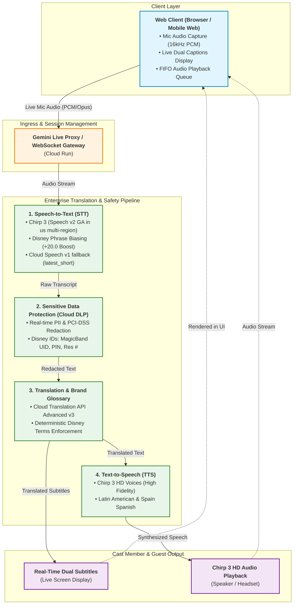

# 🏰 Disney Parks Live Translation POC (Google Cloud)

A production-ready, multi-container Proof of Concept (POC) evaluating **real-time live speech translation** for Walt Disney World & Disneyland Cast Members and International Guests, featuring **custom vocabulary and glossary injection** for Disney brand terms, attraction names, and park operations.

Powered by Google Cloud's **100% General Availability (GA)** enterprise stack: **Speech-to-Text v2 Chirp 3**, **Cloud Sensitive Data Protection (DLP)**, **Cloud Translation API Advanced v3**, and **Text-to-Speech Chirp 3 HD**.

---

## 📊 Live Translation Architecture Comparison

| Architecture Pillar | **Enterprise Production Pipeline (Primary)** 🌟 | **Multimodal Live Preview (Experimental)** |
| :--- | :--- | :--- |
| **Pipeline Nature** | **Modular Streaming Pipeline**: STT (Chirp 3) ➔ Cloud DLP ➔ MT v3 ➔ Chirp 3 HD TTS | **Speech-to-Speech (S2S)** Bidirectional WebSocket |
| **Latency Profile** | ⚡ **600ms – 1,100ms** (Sentence-boundary streaming with audio trim) | ⚡ **450ms – 850ms** (Simultaneous audio turns) |
| **Speech-to-Text (STT)**| **Cloud Speech-to-Text v2 (Chirp 3 GA, multi-region `us`)** with Speech Adaptation (+20 Disney boost) | Gemini Live Audio Transcription / Gemini 3.5 Live |
| **Data Protection & PII** | **Google Cloud Sensitive Data Protection (DLP)**: Real-time inline masking (PCI-DSS, Guest PII, MagicBand UIDs, PINs) | Prompt-level safety filters |
| **Disney Brand Glossary** | **100% Deterministic Cloud Glossary** (TSV/CSV dictionary lock) + Phrase Biasing | Contextual System Prompt injection |
| **Text-to-Speech (TTS)** | **Google Cloud Chirp 3 HD Voices** (e.g. `es-US-Chirp3-HD-Aoede` / `en-US-Chirp3-HD-Aoede`) | Built-in Gemini Live audio personas |
| **Compliance & Readiness** | 🔒 **100% GA APIs**, audit-logged, zero audio retention options, PCI & COPPA compliant | Preview features, non-deterministic phrasing |
| **Primary Use Case** | **In-Park Cast Member ↔ Guest Countertops, Kiosks & Mobile Web** | Conversational dialogue exploration |

---

## 🏛️ System Architecture



---

## 📂 Repository Structure

```
GCP-Live-Translation/
├── glossaries/
│   ├── disney_parks_glossary.json      # Structured multi-language Disney terms, phonetics & rules
│   ├── disney_glossary_en_es.csv       # Cloud Translation API Advanced CSV glossary (EN ➔ ES)
│   └── disney_glossary_es_en.csv       # Cloud Translation API Advanced CSV glossary (ES ➔ EN)
├── services/
│   ├── translation-pipeline/           # Core Service: Production GA Pipeline (FastAPI)
│   │   ├── main.py                     # FastAPI REST & WebSocket endpoints (/ws/stream-translate)
│   │   ├── pipeline.py                 # Chirp 3 STT + Cloud DLP + Translation v3 + Chirp 3 HD TTS
│   │   ├── glossary_helper.py          # GCS & Translation API Glossary manager
│   │   ├── dlp_helper.py               # Cloud Sensitive Data Protection (DLP) manager
│   │   ├── Dockerfile
│   │   └── requirements.txt
│   ├── web-client/                     # Core Service: Interactive Web & Mobile Simulator Testbed
│   │   ├── public/                     # HTML5, CSS, AudioWorklet client & Telemetry Terminal
│   │   ├── server.js                   # Node/Express API with dynamic Glossary CRUD
│   │   └── Dockerfile
│   └── gemini-live-proxy/              # Supplementary Service: Multimodal Live WebSocket Gateway (Node.js/TS)
│       ├── src/                        # WebSocket bridge and Vertex AI Live client
│       ├── Dockerfile
│       └── package.json
├── infra/
│   ├── deploy.sh                       # One-click Cloud Run multi-container deployment
│   ├── setup_glossary.sh               # Cloud Translation API Advanced glossary setup
│   └── start_proxy.sh                  # Local proxy & development runner
├── docker-compose.yml                  # Local development multi-container orchestration
└── .env.example                        # Template environment variables for custom GCP projects
```

> **Note on Native iOS App**: Experimental SwiftUI native client code is preserved on the dedicated [`ios-version`](https://github.com/John-Anthony-L/GCP-Live-Translation/tree/ios-version) git branch. The `main` branch is dedicated to the core web, pipeline, and containerized cloud services.

---

## 🚀 Deployment to GCP (Cloud Run)

### Prerequisites
- Google Cloud SDK (`gcloud`) installed and authenticated (`gcloud auth login`).
- Active Google Cloud Project with billing enabled.

### 1-Click Cloud Run Deployment
Run the deployment script (optionally passing your own `PROJECT_ID`):
```bash
PROJECT_ID="your-gcp-project-id" ./infra/deploy.sh
```

The script will automatically:
1. Enable all required GCP APIs (`aiplatform`, `translate`, `speech`, `texttospeech`, `dlp`, `run`, `storage`, `artifactregistry`, `cloudbuild`).
2. Create the Cloud Storage glossary bucket `gs://${PROJECT_ID}-glossaries`.
3. Upload `disney_glossary_en_es.csv` and configure Translation API Advanced.
4. Build and deploy **Gemini Live Proxy**, **Translation Pipeline** (configured with Chirp 3 GA STT, Cloud DLP, and Chirp 3 HD TTS), and **Web Client** containers to Cloud Run in `us-central1`.
5. Output live Cloud Run service URLs.

---

## 🧪 Testing the Live Translation POC

### Live 2-Way Translation Testbed (`http://localhost:3000`)
Open the deployed `disney-live-web-client` Cloud Run URL (or `http://localhost:3000` when running locally) on desktop, tablet, or mobile browser:

1. **Select Language Pair & Accent**:
   - 🇲🇽 **English ⇄ Latin American Spanish (`es-US`)** *(Default)*
   - 🇪🇸 **English ⇄ Spain Spanish (`es-ES`)**
   - 🇧🇷 Portuguese, 🇫🇷 French, 🇯🇵 Japanese, 🇨🇳 Mandarin
2. **Select Speech-to-Text Model**:
   - 🎙️ **Chirp 3 (Speech v2 GA)** *(Recommended)*: High-accuracy foundational model with built-in neural denoiser and Disney phrase adaptation.
   - ⚡ **Cloud Speech (`latest_short`)**: Ultra-fast single-utterance baseline model (< 10s commands).
   - ✨ **Gemini 3.5 Live Transcribe**: Multimodal transcription preview.
3. **Select Mode & Speak**:
   - **Cast Member 🎤 / Guest 🌐 Push-to-Talk**: Hold or click to speak individual turns.
   - **🎙️ Ambient 2-Way Live Stream**: Hands-free conversation mode where the system continuously listens, detects speech boundaries, redacts PII, translates, and plays back synthesized audio.
4. **Try Sample Disney Phrases**:
   - *"Excuse me, where is the Lightning Lane entrance for Space Mountain?"*
   - *"Do I need a Virtual Queue for Star Wars: Rise of the Resistance?"*
   - *"My reservation number is WDW-982341 and my PIN is 4821."* (Notice DLP automatically masks the reservation ID and PIN before translation and speech synthesis!)

---

## 🛡️ Cloud Sensitive Data Protection (DLP) & Privacy Engine

The translation pipeline integrates **Google Cloud Sensitive Data Protection (DLP)** (`dlp_helper.py`) directly between Speech Recognition and Machine Translation. This ensures that no guest PII, payment info, or security PINs are ever logged, sent to external models, or spoken aloud in public park areas.

### Supported InfoTypes Catalog

| InfoType Identifier | Category | Icon | Protected Information & Pattern | Default Mode |
| :--- | :--- | :---: | :--- | :---: |
| `CREDIT_CARD_NUMBER` | PCI Compliance | 💳 | Visa, MasterCard, Amex, Discover card numbers & CVVs | **Active** |
| `PHONE_NUMBER` | Contact Info | 📱 | US & International telephone and mobile numbers | **Active** |
| `EMAIL_ADDRESS` | Contact Info | 📧 | Guest and Cast Member personal & work email addresses | **Active** |
| `PERSON_NAME` | COPPA / Minors | 👶 | Full names of guests, children, and family members | Optional (Kiosk) |
| `US_PASSPORT` | Government ID | 🛂 | Passport numbers, national ID cards, driver's licenses | **Active** |
| `DISNEY_RESERVATION_ID` | Disney Custom | 🏰 | WDW/DLR booking confirmation numbers (`WDW-982341`, `DLR-83921`) | **Active** |
| `MAGICBAND_UID` | Disney Custom | 🪄 | MagicBand+ RFID/NFC serial numbers (`MB-A1B2C3D4`) | **Active** |
| `DISNEY_PIN` | Disney Custom | 🔑 | 4-to-6 digit MyDisneyExperience, room lock, and payment PINs | **Active** |

### Deployment Presets

The Web Testbed and backend support dynamic preset modes depending on the in-park operational context:
1. 🔒 **Public Park Kiosk**: Enables all 8 privacy filters, including `PERSON_NAME` for strict COPPA / minor privacy compliance at self-service kiosks.
2. 🏰 **Front Desk & Concierge** *(Default)*: Enforces PCI-DSS, passport, and custom Disney identifiers while allowing guest names for warm, personalized Cast Member greetings.
3. 📞 **Over-The-Phone Booking (Bypass)**: Temporarily bypasses redaction for authorized call-center agents who need to collect phone numbers and reservation IDs.

### Interactive DLP Sandbox
The Web Client features a dedicated **DLP Inspection & Redaction Sandbox** allowing operators to test custom phrases, inspect detection latency (typically < 35ms), and view granular entity match breakdowns in real time.

---

## ⚡ Live Telemetry & Running Transcript Terminal

The Web Client includes a real-time **Telemetry Terminal** that monitors every hop of the live translation pipeline:
* **🎙️ Mic Input / VAD**: Live RMS audio level meter displaying speech energy in real time.
* **🗣️ STT Capture**: Live interim and finalized transcript streaming with model attribution (`chirp_3`).
* **🛡️ Cloud DLP**: Real-time redaction status indicating detected entities and sanitization latency.
* **🌐 Translation LLM**: Progressive translation output adhering to Disney glossary rules.
* **🔊 TTS Speech**: Audio playback state and duration metrics.
* **📜 Live Log Stream**: High-resolution event stream for debugging network latency, WebSocket boundaries, and payload sizes.

---

## 🔌 API & WebSocket Endpoints Reference

### Service 2: Translation Pipeline (Port 8081)

| Method | Endpoint | Description |
| :--- | :--- | :--- |
| `GET` | `/health` | Healthcheck and active configuration status (project, location, models) |
| `GET` | `/api/dlp/catalog` | Returns the complete catalog of active and custom DLP InfoTypes |
| `POST` | `/api/dlp/sanitize` | Standalone endpoint to inspect and mask text against active DLP rules |
| `POST` | `/api/translate-text` | Translates text using Cloud Translation API Advanced v3 + Disney Glossary |
| `POST` | `/api/translate-audio` | One-shot audio transcription (Chirp 3), translation, and TTS synthesis |
| `WS` | `/ws/stream-translate` | **Real-time bidirectional WebSocket** for live sentence streaming, interim text, DLP scrubbing, and TTS audio chunks |
| `GET` | `/docs` | Interactive Swagger / OpenAPI documentation |

---

## 🚀 Getting Started with Your Own Google Cloud Project

To run this POC in your own GCP environment (without accessing any external project):

### 1. Prerequisites
* [Google Cloud SDK (`gcloud`)](https://cloud.google.com/sdk/docs/install) installed.
* [Docker Desktop](https://www.docker.com/products/docker-desktop/) or Docker engine.
* A GCP project with billing enabled.

### 2. Configure Environment Variables
Copy `.env.example` to `.env` in the repository root:
```bash
cp .env.example .env
```
Open `.env` and set `PROJECT_ID` to your Google Cloud project ID:
```env
PROJECT_ID=your-own-gcp-project-id
LOCATION=us-central1
CHIRP_REGION=us
STT_MODEL=chirp_3
GLOSSARY_ID=disney-parks-glossary-en-es
GLOSSARY_BUCKET=your-own-gcp-project-id-glossaries
```

### 3. Authenticate Google Cloud ADC
Ensure your local environment is authenticated to your project:
```bash
# Set active GCP project
gcloud config set project YOUR_PROJECT_ID

# Authenticate Application Default Credentials (ADC)
gcloud auth application-default login

# Enable required Google Cloud APIs
gcloud services enable \
  run.googleapis.com \
  speech.googleapis.com \
  translate.googleapis.com \
  texttospeech.googleapis.com \
  dlp.googleapis.com \
  aiplatform.googleapis.com \
  storage.googleapis.com
```

### 4. Run Locally with Docker Compose
```bash
docker compose up --build
```
* **Web Client & Management Dashboard:** `http://localhost:3000`
* **Translation Pipeline (Chirp 3 STT, DLP, MT v3, Chirp 3 HD TTS):** `http://localhost:8081` (API Docs: `http://localhost:8081/docs`)

---

## 📖 Disney Glossary & Terminology Management

The system preserves Disney brand equity, attractions, and park terms using a dual-layer enforcement:
1. **Prompt Biasing**: Injected into Chirp 3 Speech Adaptation (+20.0 score) and Gemini 3.5 Transcribe.
2. **Cloud Translation API Advanced v3**: Deterministic TSV/CSV glossary mapping.

### Adding & Removing Terms via Web UI
In the web interface at `http://localhost:3000`:
1. Click on the **"📖 Disney Brand Glossary"** tab.
2. Click **"➕ Add New Term"** to open the creation modal.
3. Provide the English term, translation, category, and whether to preserve the brand name. Click **"💾 Save & Enforce Term"**.
4. To remove an existing term, click the **"🗑️ Remove"** button on any glossary card.

### Programmatic Glossary API
* **List All Terms:** `GET /api/glossary`
* **Add Term:** `POST /api/glossary/terms`
  ```json
  {
    "en": "TRON Lightcycle / Run",
    "es": "TRON Lightcycle / Run",
    "category": "Attraction",
    "keep_original": true,
    "notes": "Tomorrowland coaster"
  }
  ```
* **Delete Term:** `DELETE /api/glossary/terms/:termId`
* **Sync to Cloud Storage & Translation API:** `POST http://localhost:8081/api/glossary/sync`

---

## ⚙️ Environment Variables Reference

| Variable | Default Value | Description |
| :--- | :--- | :--- |
| `PROJECT_ID` | `your-gcp-project-id` | Your Google Cloud Project ID |
| `LOCATION` | `us-central1` | Primary GCP Region for Cloud Run, Translation v3, and DLP |
| `CHIRP_REGION` | `us` | Multi-region endpoint for Speech-to-Text v2 **Chirp 3 GA** |
| `STT_MODEL` | `chirp_3` | Speech recognition model identifier (`chirp_3`, `gemini-3.5-transcribe`, `latest_short`) |
| `TTS_VOICE_NAME` | `es-US-Chirp3-HD-Aoede` | Default Google Cloud **Chirp 3 HD** voice for Latin American Spanish |
| `GLOSSARY_ID` | `disney-parks-glossary-en-es` | Cloud Translation API Advanced glossary resource ID |
| `GLOSSARY_BUCKET` | `[PROJECT_ID]-glossaries` | Cloud Storage bucket storing Disney CSV glossaries |

