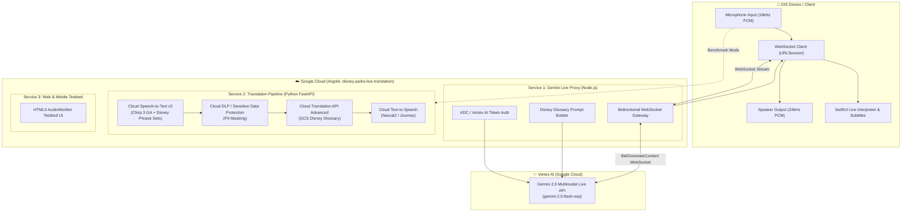

# 🏰 Disney Parks Live Translation POC (iOS & GCP)

A multi-container Proof of Concept (POC) evaluating **real-time live speech translation** for Walt Disney World & Disneyland Cast Members and International Guests, featuring **custom vocabulary and glossary injection** for Disney brand terms, attraction names, and park operations.

Deployed on Google Cloud Platform (Argolis project: `disney-parks-live-translation`).

---

## 📊 Solution Comparison Matrix

| Criteria | **Option 1: Gemini 2.0 Live API (Vertex AI)** 🌟 *(Recommended)* | **Option 2: Translation API Advanced v3 (Chirp 3)** | **Option 3: CX Agent Studio (CXAS)** |
| :--- | :--- | :--- | :--- |
| **Pipeline Nature** | **Native Speech-to-Speech (S2S)** streaming | **3-hop GA Pipeline**: STT (Chirp 3) ➔ Cloud DLP ➔ MT v3 ➔ TTS | **Agentic Conversational Bot** |
| **Speech Latency** | ⚡ **400ms – 800ms** (Real-time simultaneous) | ⏳ **750ms – 1,400ms** (Chirp 3 STT + MT + TTS) | ⏳ **1,500ms – 3,500ms+** (Intent + Agent RAG) |
| **STT Engine** | Built-in Gemini Multimodal Audio | **Cloud Speech-to-Text v2 (Chirp 3 GA, multi-region `us`)** | Dialogflow CX Speech Recognizer |
| **Glossary Injection** | **Contextual System Instruction Injection** (Adheres to brand rules, understands Disney context) | **100% Deterministic Cloud Glossary** (TSV/CSV exact dictionary lock) + Speech Adaptation | **Vertex AI Search Data Store RAG & Playbooks** |
| **PII & Privacy** | Prompt-level safety filters | **Google Cloud Sensitive Data Protection (DLP)** real-time scrubbing | Dialogflow built-in redacting |
| **Voice & Inflection** | **Natural human-like prosody**, emotion, tone | Synthetic Neural2 / Journey TTS | Synthetic Neural2 / Journey TTS |
| **iOS Architecture** | Single bidirectional **WebSocket** (`URLSessionWebSocketTask`) | Multi-service orchestration (STT ➔ MT ➔ TTS) | Dialogflow CX Audio Sessions API |
| **Best Use Case** | **Live Cast Member ↔ Guest In-Park Interpreter** | Park signage, mobile app text localization, strict deterministic compliance | Multilingual Park Concierge / FAQ bot with tool actions |

---

## 🏛️ System Architecture



---

## 📂 Repository Structure

```
Disney-live-translation-POC/
├── glossaries/
│   ├── disney_parks_glossary.json      # Structured multi-language Disney terms, phonetics & rules
│   └── disney_glossary_en_es.csv       # Cloud Translation API Advanced CSV glossary
├── services/
│   ├── gemini-live-proxy/              # Service 1: Vertex AI Gemini 2.0 Live WebSocket Proxy (Node.js/TS)
│   │   ├── src/
│   │   │   ├── server.ts               # Express & WebSocket server
│   │   │   ├── vertex_bidi_client.ts   # Vertex AI Live API client
│   │   │   ├── glossary.ts             # Dynamic system instruction & glossary builder
│   │   │   └── config.ts
│   │   ├── Dockerfile
│   │   └── package.json
│   ├── translation-pipeline/           # Service 2: Production GA Pipeline (FastAPI: Chirp 3 + Cloud DLP + MT v3 + TTS)
│   │   ├── main.py                     # FastAPI REST & WebSocket endpoints (Chirp 3 STT, DLP PII masking)
│   │   ├── pipeline.py                 # Chirp 3 (Speech v2 GA) + Translation Advanced v3 + TTS orchestrator
│   │   ├── glossary_helper.py          # GCS & Translation API Glossary manager
│   │   ├── dlp_helper.py               # Google Cloud Sensitive Data Protection (DLP) manager
│   │   ├── Dockerfile
│   │   └── requirements.txt
│   └── web-client/                     # Service 3: Interactive Web & Mobile Simulator Testbed
│       ├── public/                     # HTML5, CSS, AudioWorklet client
│       ├── server.js
│       └── Dockerfile
├── ios-app/                            # Native iOS Swift / SwiftUI Client
│   └── DisneyLiveTranslate/
│       ├── DisneyLiveTranslateApp.swift
│       ├── Services/
│       │   ├── AudioEngineManager.swift        # AVAudioEngine (16kHz in / 24kHz out)
│       │   └── LiveTranslationWebSocket.swift  # Streaming WebSocket connection
│       ├── Models/
│       │   ├── TranslationSession.swift
│       │   └── DisneyGlossary.swift
│       └── Views/
│           ├── ContentView.swift
│           ├── LiveInterpreterView.swift
│           ├── ComparisonBenchmarkView.swift
│           └── GlossaryListView.swift
├── infra/
│   ├── deploy.sh                       # One-click Cloud Run multi-container deployment
│   ├── setup_glossary.sh               # Cloud Translation API Advanced glossary setup
│   └── start_proxy.sh                  # Local proxy & development runner
└── docker-compose.yml                  # Local development multi-container orchestration
```

---

## 🚀 Deployment to GCP (Argolis Environment)

### Prerequisites
- Google Cloud SDK (`gcloud`) authenticated to your Argolis account.
- GCP Project: `disney-parks-live-translation`.

### 1-Click Cloud Run Deployment
Run the deployment script:
```bash
./infra/deploy.sh
```

The script will automatically:
1. Enable all required GCP APIs (`aiplatform`, `translate`, `speech`, `texttospeech`, `dlp`, `run`, `storage`).
2. Create the Cloud Storage glossary bucket `gs://disney-parks-live-translation-glossaries`.
3. Upload `disney_glossary_en_es.csv` and configure Translation API Advanced.
4. Build and deploy **Gemini Live Proxy**, **Translation Pipeline** (configured with Chirp 3 GA and Cloud DLP), and **Web Client** containers to Cloud Run in `us-central1`.
5. Output live Cloud Run service URLs.

---

## 🧪 Testing the Live Translation POC

### Option A: Gemini 2.0 Multimodal Live API (Web & iOS)
Open the deployed `disney-live-web-client` Cloud Run URL (or `http://localhost:3000` when running locally) on desktop or **iOS Safari**:
1. Select your target language pair (e.g., **English ⇄ Spanish** or **English ⇄ Portuguese**).
2. Choose your Gemini voice personality (**Aoede**, **Puck**, etc.).
3. Hold the microphone button and speak a Disney phrase:
   - *"Excuse me, where is the Lightning Lane entrance for Space Mountain?"*
   - *"Do I need a Virtual Queue for Star Wars: Rise of the Resistance?"*
   - *"Where can I meet Mickey Mouse in Fantasyland?"*
4. Experience real-time audio translation with Disney brand terminology preserved.

### Option B: Native iOS App (Xcode)
1. Open the `ios-app/` project in Xcode.
2. In `Models/TranslationSession.swift`, update `serverBaseUrl` to your deployed Cloud Run WebSocket URL:
   ```swift
   @Published public var serverBaseUrl: String = "wss://<YOUR-CLOUD-RUN-URL>/live-translate"
   ```
3. Run on an iPhone simulator or physical iOS device.

### Option C: 3-Hop GA Pipeline (Chirp 3 STT ➔ Cloud DLP ➔ MT v3 ➔ Neural TTS)
For enterprise production environments requiring **100% General Availability (GA)**, PCI-DSS / COPPA compliance, and deterministic glossary enforcement:
* **Speech-to-Text**: Powered by Google Cloud **Chirp 3 (`chirp_3`)** via Speech-to-Text API v2 in multi-region `us` (`us-speech.googleapis.com`). Includes **Speech Adaptation phrase sets** boosting Disney park terminology with a +20.0 score, automatic punctuation, and low-latency endpointing.
* **Sensitive Data Protection (Cloud DLP)**: Intercepts and masks sensitive guest information (credit cards, reservation numbers, MagicBand+ UIDs, PINs) before transcripts reach the translation model or TTS audio engine.
* **Machine Translation**: Cloud Translation API Advanced v3 with deterministic Cloud Storage Disney Glossary (`disney_glossary_en_es.csv`).
* **Text-to-Speech**: Cloud Text-to-Speech high-fidelity Journey & Neural2 voices.
* **Testing**: Connect via the Web Client or WebSocket endpoint at `WS /ws/stream-translate`.

---

## 🛡️ Cloud Sensitive Data Protection (DLP) & Privacy Engine

The translation pipeline integrates **Google Cloud Sensitive Data Protection (DLP)** (`dlp_helper.py`) directly between Speech Recognition and Machine Translation. This ensures that no guest PII, payment info, or security PINs are ever logged, sent to external models, or spoken aloud in public park areas.

### Supported InfoTypes Catalog

| InfoType Identifier | Category | Icon | Protected Information & Pattern | Default Mode |
| :--- | :--- | :---: | :--- | :---: |
| `CREDIT_CARD_NUMBER` | PCI Compliance | 💳 | Visa, MasterCard, Amex, Discover card numbers & CVVs | **Active** |
| `PHONE_NUMBER` | Contact Info | 📱 | US & International telephone and mobile numbers | **Active** |
| `EMAIL_ADDRESS` | Contact Info | 📧 | Guest and Cast Member personal & work email addresses | **Active** |
| `PERSON_NAME` | COPPA / Minors | 👶 | Full names of guests, children, and family members | Optional (Kiosk) |
| `US_PASSPORT` | Government ID | 🛂 | Passport numbers, national ID cards, driver's licenses | **Active** |
| `DISNEY_RESERVATION_ID` | Disney Custom | 🏰 | WDW/DLR booking confirmation numbers (`WDW-982341`, `DLR-83921`) | **Active** |
| `MAGICBAND_UID` | Disney Custom | 🪄 | MagicBand+ RFID/NFC serial numbers (`MB-A1B2C3D4`) | **Active** |
| `DISNEY_PIN` | Disney Custom | 🔑 | 4-to-6 digit MyDisneyExperience, room lock, and payment PINs | **Active** |

### Deployment Presets

The Web Testbed and backend support dynamic preset modes depending on the in-park operational context:
1. 🔒 **Public Park Kiosk**: Enables all 8 privacy filters, including `PERSON_NAME` for strict COPPA / minor privacy compliance at self-service kiosks.
2. 🏰 **Front Desk & Concierge** *(Default)*: Enforces PCI-DSS, passport, and custom Disney identifiers while allowing guest names for warm, personalized Cast Member greetings.
3. 📞 **Over-The-Phone Booking (Bypass)**: Temporarily bypasses redaction for authorized call-center agents who need to collect phone numbers and reservation IDs.

### Interactive DLP Sandbox
The Web Client features a dedicated **DLP Inspection & Redaction Sandbox** allowing operators to test custom phrases, inspect detection latency (typically < 35ms), and view granular entity match breakdowns in real time.

---

## ⚡ Live Telemetry & Running Transcript Terminal

The Web Client includes a real-time **Telemetry Terminal** that monitors every hop of the live translation pipeline:
* **🎙️ Mic Input / VAD**: Live RMS audio level meter displaying speech energy in real time.
* **🗣️ STT Capture**: Live interim and finalized transcript streaming with model attribution (`chirp_3`).
* **🛡️ Cloud DLP**: Real-time redaction status indicating detected entities and sanitization latency.
* **🌐 Translation LLM**: Progressive translation output adhering to Disney glossary rules.
* **🔊 TTS Speech**: Audio playback state and duration metrics.
* **📜 Live Log Stream**: High-resolution event stream for debugging network latency, WebSocket boundaries, and payload sizes.

---

## 🔌 API & WebSocket Endpoints Reference

### Service 2: Translation Pipeline (Port 8081)

| Method | Endpoint | Description |
| :--- | :--- | :--- |
| `GET` | `/health` | Healthcheck and active configuration status (project, location, models) |
| `GET` | `/api/dlp/catalog` | Returns the complete catalog of active and custom DLP InfoTypes |
| `POST` | `/api/dlp/sanitize` | Standalone endpoint to inspect and mask text against active DLP rules |
| `POST` | `/api/translate-text` | Translates text using Cloud Translation API Advanced v3 + Disney Glossary |
| `POST` | `/api/translate-audio` | One-shot audio transcription (Chirp 3), translation, and TTS synthesis |
| `WS` | `/ws/stream-translate` | **Real-time bidirectional WebSocket** for live sentence streaming, interim text, DLP scrubbing, and TTS audio chunks |
| `GET` | `/docs` | Interactive Swagger / OpenAPI documentation |

### Service 1: Gemini Live Proxy (Port 8080)

| Method | Endpoint | Description |
| :--- | :--- | :--- |
| `GET` | `/health` | Healthcheck and Vertex AI Live API connection status |
| `WS` | `/live-translate` | **Bidirectional WebSocket** bridging client PCM audio to Gemini 2.0 Multimodal Live API with contextual glossary injection |

---

## ⚙️ Environment Variables Reference

| Variable | Default Value | Description |
| :--- | :--- | :--- |
| `PROJECT_ID` | `disney-parks-live-translation` | Google Cloud Project ID (Argolis) |
| `LOCATION` | `us-central1` | Primary GCP Region for Cloud Run, Translation v3, and DLP |
| `CHIRP_REGION` | `us` | Multi-region endpoint for Speech-to-Text v2 **Chirp 3 GA** |
| `STT_MODEL` | `chirp_3` | Speech recognition model identifier (`chirp_3`, `latest_short`) |
| `GLOSSARY_ID` | `disney-parks-glossary-en-es` | Cloud Translation API Advanced glossary resource ID |
| `GLOSSARY_BUCKET` | `disney-parks-live-translation-glossaries` | Cloud Storage bucket storing Disney CSV glossaries |
| `GEMINI_LIVE_MODEL` | `gemini-2.0-flash-exp` | Vertex AI Gemini Multimodal Live model |
| `DEFAULT_VOICE` | `Aoede` | Default Gemini Live voice personality |

---

## 📖 Disney Glossary & Brand Enforcement Rules

The following terms are protected and automatically injected into every live session:

| Disney Term | Category | Policy | Translation Rule |
| :--- | :--- | :--- | :--- |
| **Lightning Lane** | Service | 🔒 Preserve Brand | Keep as *Lightning Lane* |
| **MagicBand+** | Merchandise | 🔒 Preserve Brand | Keep as *MagicBand+* |
| **Cast Member** | Personnel | 🔄 Respectful Equivalent | Spanish: *Miembro del Elenco* / French: *Cast Member* |
| **Rope Drop** | Concept | 🔄 Contextual | Spanish: *Apertura del parque* |
| **Space Mountain** | Attraction | 🔒 Preserve Brand | Keep as *Space Mountain* |
| **Rise of the Resistance** | Attraction | 🔒 Preserve Brand | Keep as *Star Wars: Rise of the Resistance* |
| **Virtual Queue** | Service | 🔄 Localized | Spanish: *Fila Virtual* |
| **Park Hopper** | Ticket | 🔒 Preserve Brand | Keep as *Boleto Park Hopper* |

---

## 💻 Local Development with Docker Compose

To run all 3 services locally:
```bash
# 1. Authenticate Application Default Credentials (ADC)
gcloud auth application-default login

# 2. Start all containers
docker compose up --build
```
* **Web & Mobile Testbed:** `http://localhost:3000`
* **Gemini Live Proxy (WS):** `ws://localhost:8080/live-translate`
* **Translation Pipeline (Chirp 3 + DLP + MT + TTS):** `http://localhost:8081` (Swagger Docs: `http://localhost:8081/docs`)

