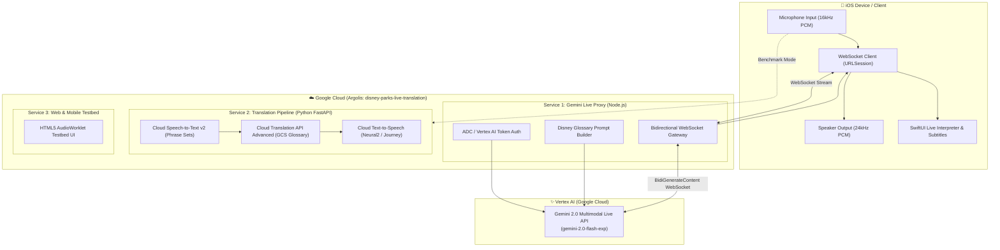

# 🏰 Disney Parks Live Translation POC (iOS & GCP)

A multi-container Proof of Concept (POC) evaluating **real-time live speech translation** for Walt Disney World & Disneyland Cast Members and International Guests, featuring **custom vocabulary and glossary injection** for Disney brand terms, attraction names, and park operations.

Deployed on Google Cloud Platform (Argolis project: `disney-parks-live-translation`).

---

## 📊 Solution Comparison Matrix

| Criteria | **Option 1: Gemini 2.0 Live API (Vertex AI)** 🌟 *(Recommended)* | **Option 2: Translation API Advanced v3** | **Option 3: CX Agent Studio (CXAS)** |
| :--- | :--- | :--- | :--- |
| **Pipeline Nature** | **Native Speech-to-Speech (S2S)** streaming | **Text-to-Text (MT)** multi-hop pipeline | **Agentic Conversational Bot** |
| **Speech Latency** | ⚡ **400ms – 800ms** (Real-time simultaneous) | ⏳ **950ms – 1,800ms** (STT + MT + TTS) | ⏳ **1,500ms – 3,500ms+** (Intent + Agent RAG) |
| **Glossary Injection** | **Contextual System Instruction Injection** (Adheres to brand rules, understands Disney context) | **100% Deterministic Cloud Glossary** (TSV/CSV/TMX exact dictionary lock) | **Vertex AI Search Data Store RAG & Playbooks** |
| **Voice & Inflection** | **Natural human-like prosody**, emotion, tone | Synthetic Neural2 / Journey TTS | Synthetic Neural2 / Journey TTS |
| **iOS Architecture** | Single bidirectional **WebSocket** (`URLSessionWebSocketTask`) | Multi-service orchestration (STT ➔ MT ➔ TTS) | Dialogflow CX Audio Sessions API |
| **Best Use Case** | **Live Cast Member ↔ Guest In-Park Interpreter** | Park signage, mobile app text localization | Multilingual Park Concierge / FAQ bot with tool actions |

---

## 🏛️ System Architecture



---

## 📂 Repository Structure

```
Disney-live-translation-POC/
├── glossaries/
│   ├── disney_parks_glossary.json      # Structured multi-language Disney terms, phonetics & rules
│   └── disney_glossary_en_es.csv       # Cloud Translation API Advanced CSV glossary
├── services/
│   ├── gemini-live-proxy/              # Service 1: Vertex AI Gemini 2.0 Live WebSocket Proxy (Node.js/TS)
│   │   ├── src/
│   │   │   ├── server.ts               # Express & WebSocket server
│   │   │   ├── vertex_bidi_client.ts   # Vertex AI Live API client
│   │   │   ├── glossary.ts             # Dynamic system instruction & glossary builder
│   │   │   └── config.ts
│   │   ├── Dockerfile
│   │   └── package.json
│   ├── translation-pipeline/           # Service 2: Competitor Pipeline (Python FastAPI)
│   │   ├── main.py                     # FastAPI REST & WebSocket endpoints
│   │   ├── pipeline.py                 # STT v2 + Translation Advanced v3 + TTS orchestrator
│   │   ├── glossary_helper.py          # GCS & Translation API Glossary manager
│   │   ├── Dockerfile
│   │   └── requirements.txt
│   └── web-client/                     # Service 3: Interactive Web & Mobile Simulator Testbed
│       ├── public/                     # HTML5, CSS, AudioWorklet client
│       ├── server.js
│       └── Dockerfile
├── ios-app/                            # Native iOS Swift / SwiftUI Client
│   └── DisneyLiveTranslate/
│       ├── DisneyLiveTranslateApp.swift
│       ├── Services/
│       │   ├── AudioEngineManager.swift        # AVAudioEngine (16kHz in / 24kHz out)
│       │   └── LiveTranslationWebSocket.swift  # Streaming WebSocket connection
│       ├── Models/
│       │   ├── TranslationSession.swift
│       │   └── DisneyGlossary.swift
│       └── Views/
│           ├── ContentView.swift
│           ├── LiveInterpreterView.swift
│           ├── ComparisonBenchmarkView.swift
│           └── GlossaryListView.swift
├── infra/
│   ├── deploy.sh                       # One-click Cloud Run multi-container deployment
│   └── setup_glossary.sh               # Cloud Translation API Advanced glossary setup
└── docker-compose.yml                  # Local development multi-container orchestration
```

---

## 🚀 Deployment to GCP (Argolis Environment)

### Prerequisites
- Google Cloud SDK (`gcloud`) authenticated to your Argolis account.
- GCP Project: `disney-parks-live-translation`.

### 1-Click Cloud Run Deployment
Run the deployment script:
```bash
./infra/deploy.sh
```

The script will automatically:
1. Enable all required GCP APIs (`aiplatform`, `translate`, `speech`, `texttospeech`, `run`, `storage`).
2. Create the Cloud Storage glossary bucket `gs://disney-parks-live-translation-glossaries`.
3. Upload `disney_glossary_en_es.csv` and configure Translation API Advanced.
4. Build and deploy **Gemini Live Proxy**, **Translation Pipeline**, and **Web Client** containers to Cloud Run in `us-central1`.
5. Output live Cloud Run service URLs.

---

## 🧪 Testing the Live Translation POC

### Option A: Web & Mobile Browser Testbed
Open the deployed `disney-live-web-client` Cloud Run URL (or `http://localhost:3000` when running locally) on desktop or **iOS Safari**:
1. Select your target language pair (e.g., **English ⇄ Spanish** or **English ⇄ Portuguese**).
2. Choose your Gemini voice personality (**Aoede**, **Puck**, etc.).
3. Hold the microphone button and speak a Disney phrase:
   - *"Excuse me, where is the Lightning Lane entrance for Space Mountain?"*
   - *"Do I need a Virtual Queue for Star Wars: Rise of the Resistance?"*
   - *"Where can I meet Mickey Mouse in Fantasyland?"*
4. Experience real-time audio translation with Disney brand terminology preserved.

### Option B: Native iOS App (Xcode)
1. Open the `ios-app/` project in Xcode.
2. In `Models/TranslationSession.swift`, update `serverBaseUrl` to your deployed Cloud Run WebSocket URL:
   ```swift
   @Published public var serverBaseUrl: String = "wss://<YOUR-CLOUD-RUN-URL>/live-translate"
   ```
3. Run on an iPhone simulator or physical iOS device.

---

## 📖 Disney Glossary & Brand Enforcement Rules

The following terms are protected and automatically injected into every live session:

| Disney Term | Category | Policy | Translation Rule |
| :--- | :--- | :--- | :--- |
| **Lightning Lane** | Service | 🔒 Preserve Brand | Keep as *Lightning Lane* |
| **MagicBand+** | Merchandise | 🔒 Preserve Brand | Keep as *MagicBand+* |
| **Cast Member** | Personnel | 🔄 Respectful Equivalent | Spanish: *Miembro del Elenco* / French: *Cast Member* |
| **Rope Drop** | Concept | 🔄 Contextual | Spanish: *Apertura del parque* |
| **Space Mountain** | Attraction | 🔒 Preserve Brand | Keep as *Space Mountain* |
| **Rise of the Resistance** | Attraction | 🔒 Preserve Brand | Keep as *Star Wars: Rise of the Resistance* |
| **Virtual Queue** | Service | 🔄 Localized | Spanish: *Fila Virtual* |
| **Park Hopper** | Ticket | 🔒 Preserve Brand | Keep as *Boleto Park Hopper* |

---

## 💻 Local Development with Docker Compose

To run all 3 services locally:
```bash
# 1. Authenticate Application Default Credentials (ADC)
gcloud auth application-default login

# 2. Start all containers
docker compose up --build
```
- **Web Testbed:** `http://localhost:3000`
- **Gemini Live Proxy:** `ws://localhost:8080/live-translate`
- **Translation Pipeline:** `http://localhost:8081`
